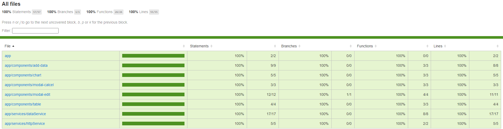

# Itau

Conteúdo do projeto
* 3 tipos de gráficos podendo ser escolhidos por um radio button.
* Tabela com a possibilidade de adição ou alterações que afetam o gráfico simultaneamente.

## Development server

Run `ng serve` for a dev server. Navigate to `http://localhost:4200/`. The application will automatically reload if you change any of the source files.

## Build

Run `ng build` to build the project. The build artifacts will be stored in the `dist/` directory.

## Running unit tests

Run `ng test` to execute the unit tests via [Karma](https://karma-runner.github.io).

